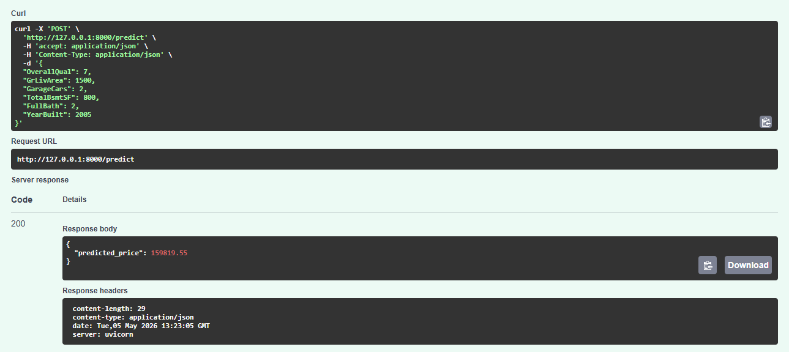

# 🏠 Housing Price Prediction (ML Project)

## 📌 Overview
This project builds an end-to-end machine learning pipeline to predict housing prices.

## 🛠 Tech Stack
- Python
- pandas, numpy
- scikit-learn
- matplotlib

## 📊 Dataset
Kaggle House Prices dataset

## 🚀 Progress
- [x] Project setup
- [x] Initial EDA
- [x] Feature engineering
- [x] Baseline + Random Forest model
- [x] ML pipeline (sklearn Pipeline)
- [x] Model saved (.pkl)
- [x] API deployment (FastAPI)
- [ ] Dockerization

## 📁 Structure
- notebooks/ → EDA and experiments  
- src/ → pipeline code
- api/ → deployment code

## 📈 Next Steps
- Dockerization

## 🚀 API Demo

Below is the FastAPI endpoint in action:

